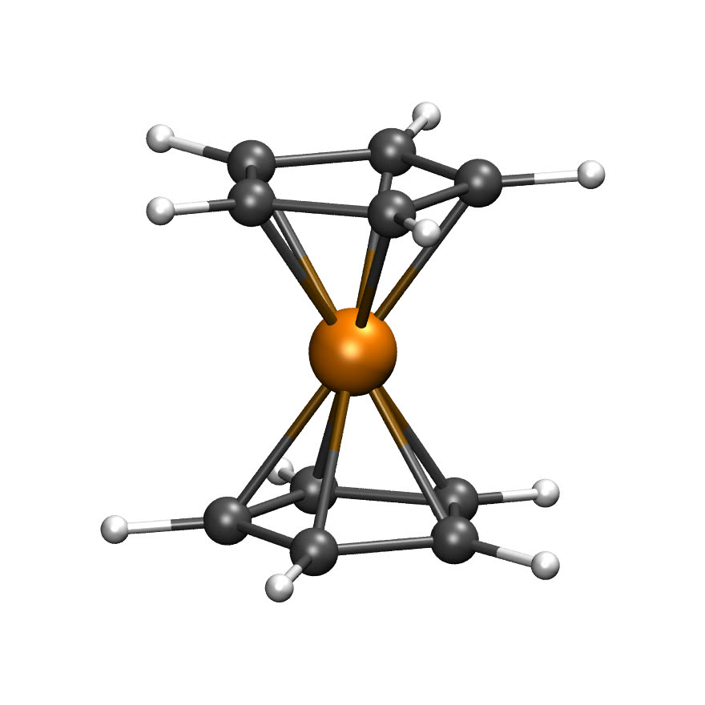
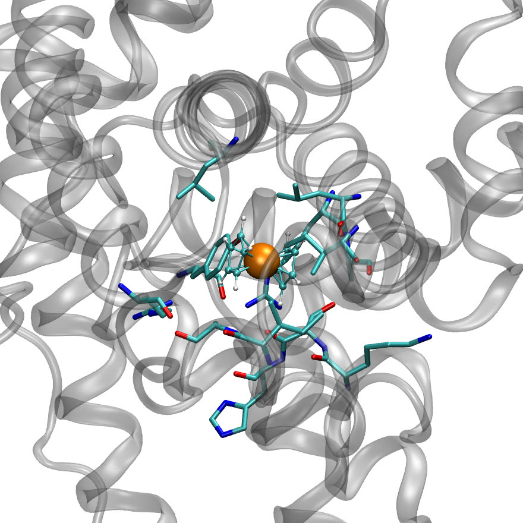

# Demo workflow — ferrocene into human serum albumin

**HSA + Ferrocene (Sudlow site I)** — `workflows/metaldock-hsa-ferrocene.json`

This is the package's second worked example, and it exists because the first one
answers an easier question than a user will actually ask.

## Why a second demo

The 1JZI case is a **redocking**. The Re complex is taken out of the crystal it
came from and put back, so the binding site is known before the run starts and
success is scored as RMSD against the crystallographic pose. That is the right
way to validate a method, and it is what the MetalDock paper reports.

It is not what a user does. A user has a protein and a complex that has never
been co-crystallised with it, and wants to know where — if anywhere — the complex
binds. Nothing in the 1JZI demo teaches the step that question turns on.

Suggested by **Sylvestre Bonnet**, PI of the MetalDock tool, who pointed out that
the demo should dock into a protein with no metal complex bound, and named human
serum albumin as the system to do it with.

## The case

| | |
|---|---|
| Receptor | **1AO6**, human serum albumin, chain A |
| Ligand | **ferrocene**, Fe(C₅H₅)₂, GFN1-xTB optimised |
| Site | **Sudlow site I**, subdomain IIA |
| Box | centre `34.64, 32.92, 36.18`, 20 Å cube |
| Charges | GFN1-xTB, neutral, closed shell |

**Chain A only.** 1AO6 contains two identical copies; HSA is monomeric in
solution, so the second is a crystallographic artefact. Docking into a spurious
dimer interface is an easy way to get a confident wrong answer.

**The receptor is genuinely apo.** 1AO6's only HETATM records are seven waters,
which `clean_pdb` removes. There is no complex to strip and no pose to lean on.

**The ligand is independent.** `ferrocene.xyz` is an optimised geometry, not
something extracted from the receptor. Fe–C comes out at 2.064–2.066 Å against
~2.04–2.06 Å measured for ferrocene, which is the check that the input is sane
before any docking happens.

## The part that matters: choosing the site

AutoDock requires a `gridcenter`. It accepts `auto`, which means *the receptor's
centre of mass* — almost never a binding site. This package's own default, an
empty `box_center`, centres on the **ligand's own metal atom**, which is only
meaningful when the ligand's coordinates came out of the receptor's crystal. For
a prediction, neither default is usable. **You must choose.**

Two attempts were made, and the difference is the lesson.

**Attempt 1 — the centroid of Trp214.** Trp214 lines Sudlow site I and is the
residue everyone names when describing it, so its centroid looks like a
reasonable centre. It is **9.7 Å** from the pocket, which with a 20 Å box puts
the real site on the boundary where the grid is poorest.

**Attempt 2 — the position of a co-crystallised ligand.** R-warfarin is the
canonical Sudlow I probe. Taking its centroid from **2BXD** and transferring it
into the 1AO6 frame by Kabsch superposition over all 578 Cα atoms (RMSD 0.88 Å)
gives the shipped centre.

| | Trp214 centroid | warfarin position |
|---|---|---|
| best ΔG | −2.63 kcal/mol | **−3.00** |
| spread across poses | 0.45 kcal/mol | **0.01** |
| Fe to box centre | 6.6 Å | 3.6 Å |
| contacting residues | 328–354 — subdomain **IIB** | **11 of 12 in IIA** |

Neither run errored. The wrong one returned a plausible-looking number for a
pose in the wrong subdomain. That is the failure mode this demo exists to show.

**A residue centroid is not a pocket centroid. A co-crystallised ligand is.**

Where no co-crystal exists, use a pocket detector (fpocket, P2Rank, CASTp)
rather than guessing from sequence.

## The structures



Ferrocene as the template ships it. All ten Fe–C contacts fall between 2.064 and
2.066 Å against roughly 2.04–2.06 Å measured — the check that the input is sound
before any docking happens. Nothing declares that bonding: the graph builder
infers it from distance against covalent radii, and η⁵ coordination falls out.



The best-scoring pose in Sudlow site I. Closest approaches: ILE290 1.53 Å,
LEU260 1.54 Å, LEU238 1.88 Å, SER287 1.94 Å, ARG257 2.03 Å. Both figures are
rendered from a real run by `workflows/vmd/`, not drawn.

## Expected outputs

```
poses 10   best −3.00   median −3.00   spread 0.01 kcal/mol
contacts 12, of which 11 in subdomain IIA:
  TYR150, ARG222, LEU238, ARG257, LEU260, ALA261,
  ILE264, LYS286, SER287, HIS288, ILE290, ALA291
```

Those are the residues the albumin literature names for Sudlow I. The energy is
modest because ferrocene is small and neutral; the *pose* is the result worth
reading, not the number.

**The contact count varies between runs and that is expected.** AutoDock seeds its
genetic algorithm from `pid time`, so repeated runs explore differently. Observed
across runs of this template: 11 or 12 contacting residues, with HIS288 the one
that comes and goes. What does *not* vary is the binding energy (−3.00 kcal/mol),
the convergence (all poses within 0.01), or the pocket — every run puts the ligand
in subdomain IIA among the same core residues. Judge a re-run on those, not on an
exact residue count.

**`rmsd_values` is empty, deliberately.** `reference_xyz` is left blank because
no crystallographic pose exists to compare against. Leaving 1JZI's reference in
place would have compared a ferrocene pose to a rhenium complex and printed a
number that looks like validation and means nothing.

## Provenance of this template

The shipped JSON was round-tripped through the app: loaded from the Hub via the
template picker, executed, then exported with `POST /api/workflow/{id}/export-template`
and diffed against the file in this package.

Everything the canvas owns matches exactly — 6 nodes, 5 links, identical node
geometry, identical `graph` and `flow_vars`, and **zero differences across every
configured parameter**.

`template_info` is the exception, and it is worth knowing why:

| field | UI export | shipped |
|---|---|---|
| `id` | `hsa-ferrocene-sudlow-site-i` (derived from the name) | `metaldock-hsa-ferrocene` |
| `category` | *(dropped)* | `molecular-docking` |
| `difficulty` | *(dropped)* | `advanced` |
| `estimated_time` | *(dropped)* | `5 minutes` |
| `author` | *(dropped)* | `BoundaryComputing` |
| `tags` | *(dropped)* | 10 tags |

**A raw UI export is therefore not a shippable template.** Those fields are
curation — they decide how the template appears in the picker and cannot be
recovered from a canvas, because the canvas never knew them. The `id` matters
doubly: it is what `registry.json` keys on, so letting the export regenerate it
would silently orphan the registry entry.

Export to verify the workflow; keep the curated header.

### And the file held its ancestor's inputs

That diff compared `config`, which is what runs — and `config` was right. But the
template stores each parameter **four** times, and the other three were still the
1JZI template's, because this one was derived from it:

```
react…models[].options.config                <- correct, what runs
react…models[].config                        <- stale
react…models[].options.option_types[].value  <- stale
graph.nodes[].options                        <- stale
```

Nothing read them: execution and the config panel both go through `option_values`,
which is why the runs were correct throughout. But `1jzi.pdb`, `1jzi_D_REP.xyz` and
`case_name: 1jzi_re` appeared 21 times in a file describing an albumin docking —
and the JSON is how a reviewer checks what a template does.

All four are now synced. Verified after the fix: `1jzi` appears **zero** times, all
four copies agree on every parameter, and a fresh install from the Hub reproduces
the result — −3.00 kcal/mol, 10 of 11 contacts in subdomain IIA.

**The exporter still does this**, so the next template derived from another will
inherit the same way. Tracked as `bocoflow#113`.

One thing worth carrying from the repair: fixing the three locations that had been
identified still left `1jzi` in the file nine times. Only searching the whole file
for the ancestor's name found the fourth. The check worth writing is *"the ancestor
appears nowhere"*, not *"location X is correct"*.

## What this case also establishes

Fe takes a different code path from Re. It is in `INTERNAL_PARAM_METALS`, so
`get_lj_params` returns `None`, no `nbp_r_eps` lines are written, and docking
relies on `atom_par Fe` from `metal_dock.dat`. Before this demo that branch had
never been executed — Fe was declared supported and unit-tested at the API level,
but no docking run had used it.

It works. xtb converges CM5 charges on Fe(II), and `xyz2graph` resolves η⁵
sandwich bonding from covalent radii alone: 30 bonds for 21 atoms, being 10 C–H,
10 C–C and 10 Fe–C.
