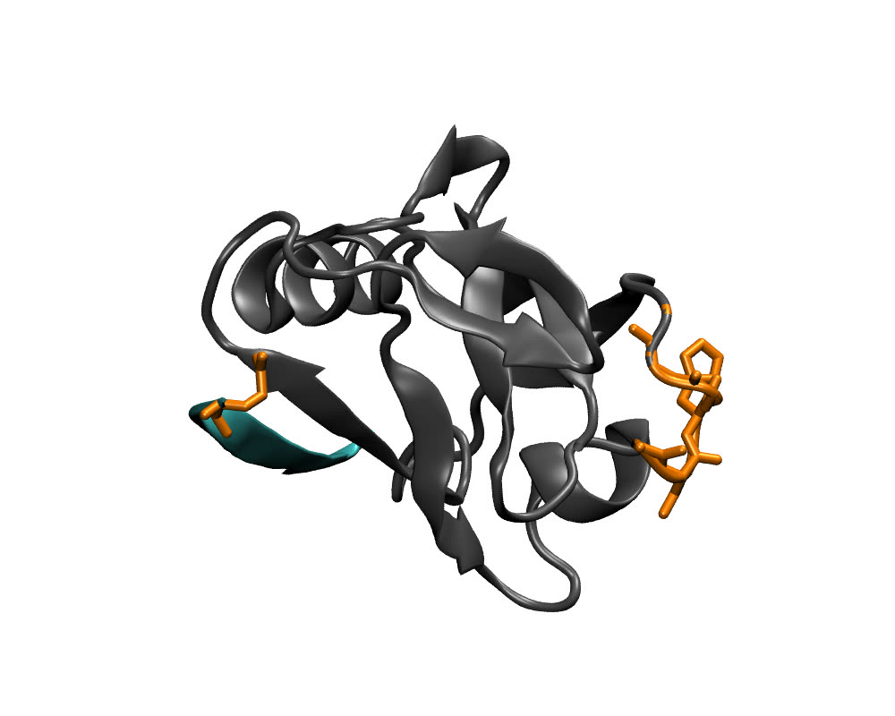
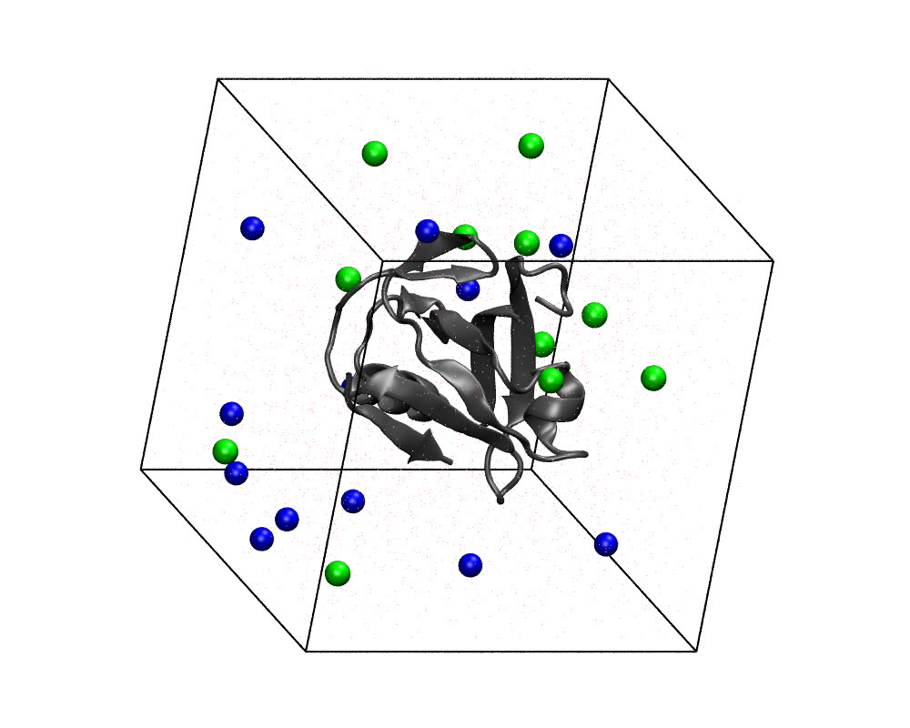
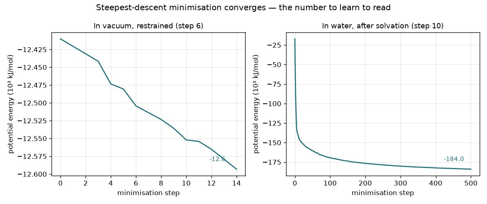

# 4Z8J: a PDZ domain and its peptide, from PDB entry to solvated system

The bundled template takes one PDB identifier and returns a complete, protonated, solvated and
energy-relaxed system with a short test trajectory — every intermediate on disk.

| | |
|---|---|
| Structure | **4Z8J**, 0.95 Å — the SNX27 PDZ domain bound to the C-terminal PDZ-binding motif of the parathyroid hormone receptor |
| Chains | **A** the PDZ domain (101 residues in sequence, 96 resolved) · **B** the peptide `QEEWETVM` (8, 7 resolved) |
| Unresolved residues | **six**, all N-terminal: A Gly33–Gly37 (`GSHGG`, a tag remnant) and B Gln586 |
| pH | 7 |
| Force field | amber99sb, TIP3P water |
| Box | 5.0 nm cube |
| Ions | 0.15 M NaCl, neutralised — 12 Na⁺, 11 Cl⁻ |
| Production | 2 ps (1000 × 2 fs) at 300 K |
| Runtime | 3–5½ min on an Intel laptop (three runs), ≈ 2 min on an Apple Silicon Mac Mini; the first install adds 3½ min on a Mac, ≈ 20 min on Windows through WSL2 |

## Before you run

- **Network.** Step 1 fetches 4Z8J from the RCSB PDB. Offline, set *Input mode* to a local file.
- **A working directory.** Everything lands under `<working directory>/pdbmdauto-e2e-full/e2e_4z8j/`
  (the case name comes from the template). Choose an empty folder.
- **The first install** builds a 3.1 GB environment once (GROMACS, ProMod3, OpenStructure, PDB2PQR,
  PROPKA, Biopython, OpenMM). On Windows Salpa sets that environment up inside WSL2 for you.

## The structure



The model after step 5. The five-residue tag on the domain's N-terminus and the peptide's first
residue were not located in the experiment; ProMod3 built them. They hang off the ends, where a
terminal extension has nothing to pack against — a reminder that a rebuilt residue is a prediction.

## The pipeline

Eleven nodes in a line. Each reads what the previous one wrote and adds its own files to the case
directory. Paths below are relative to `pdbmdauto-e2e-full/e2e_4z8j/`.

### 1 · PDB FASTA Parser — Biopython, RCSB PDB

| | |
|---|---|
| takes | the PDB id `4Z8J`, pH 7, case name `e2e_4z8j` |
| writes | `4Z8J.pdb`, `4Z8J_rcsb.fasta`, `chain_A.fasta`, `chain_B.fasta`, `missing_residues_chain_A.csv`, `missing_residues_chain_B.csv` |
| set here | *Input mode* (PDB id or local file), *PDB id*, *pH* |

Downloads the entry, splits it by chain, and reads the header's `REMARK 465` records into one CSV
per chain: which residues the sequence has and the coordinates do not. For 4Z8J that is five rows
for chain A (33–37) and one for chain B (586).

### 2 · Generate Alignment

| | |
|---|---|
| takes | the structure and per-chain sequences |
| writes | `A/homology.ali`, `B/homology.ali` (+ `.seq`) |

Aligns each chain's resolved residues to its full sequence — the gaps in that alignment are what
step 5 will build.

### 3 · Multi-Chain Alignment

| | |
|---|---|
| writes | `Merge/homology.ali` |

Consolidates the per-chain alignments into one, so the complex is modelled as a unit.

### 4 · Merge PDB Chains — Biopython

| | |
|---|---|
| writes | `Merge/merge.pdb`, `Merge/chain_type.json`, `Merge/chain_name.json` |

Writes the selected chains as one model, **dropping water and hetero residues** (ligands, ions,
cofactors). If your system needs a bound ligand, this is the step to notice.

### 5 · Fix Missing Residues — ProMod3 / OpenStructure

| | |
|---|---|
| takes | `Merge/merge.pdb`, `Merge/homology.ali` |
| writes | `Merge/alignment_A.fasta`, `Merge/alignment_B.fasta`, `Merge/fixed.pdb` |

Builds the six missing residues, reconstructs sidechains and briefly minimises. In the reference run
chain A went from 96 to 101 residues and chain B from 7 to 8. Two things to know: ProMod3
**renumbers from 1** (`merge.pdb` carried 38–133 and 587–593; `fixed.pdb` reads 1–101 and 1–8),
and the *Model Terminal Extensions* option has no effect in this version — termini are always
built.

### 6 · pKa + GROMACS EM — PROPKA, PDB2PQR, GROMACS

| | |
|---|---|
| takes | `Merge/fixed.pdb`, pH 7 |
| writes | `gmx/propka.pqr`, `gmx/protonated.pdb`, `gmx/pdb2gmx.gro`, `gmx/pdb2gmx.top` (+ per-chain `.itp`, `posre.itp`), `gmx/box.gro`, `gmx/em_noconstr.*`, `gmx/em_hbonds.*` |
| set here | force field and water model (`amber99sb`, `tip3p`), the two `.mdp` files |

`pdb2pqr --ff AMBER --titration-state-method=propka --with-ph=7.00` decides which His, Asp, Glu,
Lys and Arg are charged at pH 7 and adds hydrogens; `pdb2gmx -ff amber99sb -water tip3p -ignh`
writes the topology; `editconf -d 2` puts a box around it; two steepest-descent minimisations
follow, first without constraints, then with H-bond constraints. Reference run: the constrained
one **converged to Fmax < 1000 in 15 steps** at −1.26 × 10⁴ kJ/mol.

### 7 · Original Atom Groups — GROMACS

| | |
|---|---|
| writes | `gmx/index.ndx` with two extra groups, `OriHeavy` and `OriBackBone` |

Marks which atoms came from the experiment, so the next step can hold them still while the rebuilt
ones move. Reference run: **OriHeavy 776 atoms, OriBackBone 414** — the 103 resolved residues × 4
backbone atoms + 2 terminal oxygens, exactly the six rebuilt residues excluded.

### 8 · GMX MD Relaxation (restrained) — GROMACS, protocol `full_4step`

| | |
|---|---|
| takes | `gmx/em_hbonds.gro`, `gmx/pdb2gmx.top`, `gmx/index.ndx` |
| writes | `gmx/nvt_fixOri.*`, `gmx/nvt_fixOriBackbone.*`, `gmx/mm1.*`, `gmx/mm2.*` |
| set here | *Protocol* (`full_4step` here, `em_only` at step 10) |

Four stages in vacuo: 5 ps of NVT at 300 K with every experimental heavy atom frozen, the same with
only the experimental backbone frozen, then two conjugate-gradient minimisations. The rebuilt
residues settle; the crystal structure does not drift. Reference run: the last minimisation
converged to Fmax < 100 in 7 steps at −1.55 × 10⁴ kJ/mol. **This is the slowest step** — 84 s on a
cold laptop, 222 s on the same laptop once hot.

### 9 · GMX Solvate & Ionize — GROMACS

| | |
|---|---|
| takes | `gmx/mm2.gro`, `gmx/pdb2gmx.top`, `demo_data/ions.mdp` (shipped with the node) |
| writes | `gmx/box.gro` (rewritten as a 5 nm cube), `gmx/solv.gro`, `gmx/ion.tpr`, `gmx/ion.gro`, `gmx/topol.top` |
| set here | box size, salt concentration, ion names |

`editconf -box 5 5 5`, `solvate` with SPC216, then `genion -neutral -conc 0.15 -pname NA -nname CL`.
Reference run: 3,509 waters; the complex carried a charge of −1, so 12 Na⁺ and 11 Cl⁻ bring it to
zero at 0.15 M; **12,193 atoms** in total.



### 10 · GMX MD Relaxation (solvated) — GROMACS, protocol `em_only`

| | |
|---|---|
| takes | `gmx/ion.gro`, `gmx/topol.top` |
| writes | `gmx/em.tpr`, `gmx/em.gro`, `gmx/em.log`, `gmx/em.edr` |

One steepest-descent minimisation of the whole box, 500 steps, tolerance 500. Reference run: it
**stops at the step limit** with Fmax ≈ 2.9 × 10³ kJ mol⁻¹ nm⁻¹ and a potential energy of
−1.84 × 10⁵ kJ/mol — the water has relaxed onto the protein (compare the curve below) but the
tolerance is not met. For the demonstration that is enough; for a production study raise
`nsteps` in `em.mdp` until it converges.



### 11 · GROMACS MD Run (Local) — GROMACS

| | |
|---|---|
| takes | `gmx/em.gro`, `gmx/topol.top`, `demo_data/md.mdp` (shipped with the node) |
| writes | `gmx/md.tpr`, `gmx/md.gro`, `gmx/md.trr`, `gmx/md.edr`, `gmx/md.log`, `gmx/md.cpt` |
| set here | the `.mdp` file — steps, time step, thermostat |

1000 steps of 2 fs at 300 K (velocity rescaling, no pressure coupling), coordinates every 100 steps:
**11 frames in `md.trr`** (uncompressed; no `.xtc` is written). `gen_seed = -1` in the shipped
`md.mdp`, so velocities — and therefore trajectories — differ from run to run. Reference run:
31.6 ns/day on the cold laptop, 9.1 ns/day once hot.

## Looking at the result

```bash
vmd Merge/fixed.pdb                      # the completed model — colour by chain, find the termini
vmd gmx/md.gro gmx/md.trr                # the trajectory, 11 frames
printf 'Potential\n0\n' | gmx energy -f gmx/em.edr -o em.xvg   # the curve above
grep -E 'converged|Potential Energy|Maximum force' gmx/em_hbonds.log gmx/em.log
```

## Expected result

From the reference run (Intel MacBook Pro, Salpa 0.3.1, pdbmdauto 1.2.0, 2026-09-03):

```
rebuilt residues     A 33-37 (GSHGG) + B 586 (Gln)  →  fixed.pdb chain A 1-101, chain B 1-8
index groups         OriHeavy 776   OriBackBone 414   Protein 1643 (with H)
vacuum EM (step 6)   converged Fmax < 1000 in 15 steps   E = -1.26e4 kJ/mol
solvated system      12193 atoms   3509 SOL   12 NA   11 CL   charge -1 → 0   box 5.0 nm
solvated EM (step 10) 500 steps, not converged   E = -1.84e5 kJ/mol   Fmax = 2.9e3
production           1000 × 2 fs = 2 ps   11 frames in md.trr   9-32 ns/day
```

What varies between runs: the rebuilt residues' exact coordinates (ProMod3 samples), the MD
velocities (random seed), and the last digits of the energies. What must not vary: six residues
rebuilt, 12,193 atoms, a neutral system, eleven nodes green.

## Runtime

| Machine | What | Time |
|---|---|---|
| Intel MacBook Pro (i7-9750H, 6 cores, macOS 15.7), Salpa 0.3.1, GROMACS 2026.3 AVX2 | full pipeline, three runs | 179 s · 313 s · 329 s |
| same | first install, empty package cache | 212 s |
| Apple Silicon Mac Mini, native arm64 (2026-08) | full pipeline | ≈ 2 min |
| Windows 11 in a VM, WSL2 (2026-04) | first install | 19–22 min |

The Intel spread is thermal: a back-to-back run on a hot laptop took 2.5× longer in every GROMACS
stage. The template's "5 minutes" is the honest round figure for an Intel laptop.

## Regenerating the figures

`vmd/README.md` beside this file — two headless VMD renders and one matplotlib plot, from the
files a run leaves behind.
